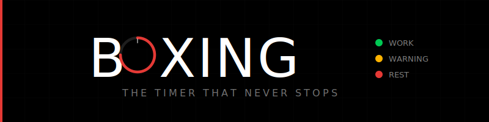
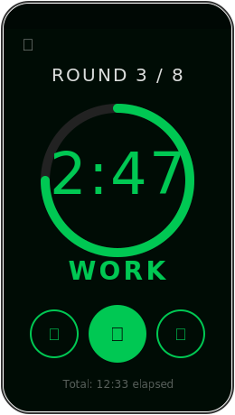
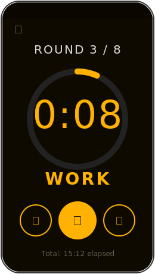
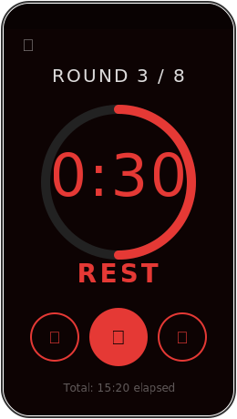

<p align="center">
  
</p>

<p align="center">
  <strong>A boxing-first training timer for Android & iOS.</strong><br/>
  Built to solve the #1 complaint across every competing app: <em>the timer dies in the background.</em>
</p>

<p align="center">
  
  
  
  
</p>

---

<p align="center">
  
  &nbsp;&nbsp;&nbsp;
  
  &nbsp;&nbsp;&nbsp;
  
</p>

<p align="center">
  <sub>Phase colors: <strong style="color:#00C853;">WORK</strong> (green) &rarr; <strong style="color:#FFB300;">WARNING</strong> (amber) &rarr; <strong style="color:#E53935;">REST</strong> (red)</sub>
</p>

---

## Why Boxing?

Every boxing timer app on the market shares the same fatal flaw: **the timer stops when you need it most** — when the screen locks, when you switch to Spotify, when Samsung's battery optimization decides your workout is over.

Boxing fixes this with a DateTime-anchored timer engine, foreground service audio, and silent keep-alive — so the bell rings no matter what.

### What makes it different

| Problem | Everyone Else | Boxing |
|---------|--------------|--------|
| Timer in background | Stops or drifts | DateTime-anchored, self-corrects every 50ms |
| Audio over music | Stops Spotify entirely | Audio ducking — bell plays over your music |
| Using with gloves | "Push start with your tongue" | 64-80dp touch targets, designed for gloves |
| Sound quality | Generic beeps | Authentic gym bell sounds, 3 sound packs |
| Pricing | Subscription for a timer | One-time purchase, zero ads |
| Bloat | HIIT/Yoga/CrossFit/Everything | Boxing-first. Period. |

---

## Features

### Timer Engine
- **DateTime-anchored** — cannot drift, survives backgrounding and screen lock
- **Foreground service** — runs reliably on Samsung, Huawei, Xiaomi
- **Silent audio keep-alive** — prevents OS from killing the process
- **Checkpoint recovery** — resume interrupted sessions after crashes

### Audio
- **3 sound packs** — Classic Bell, Digital Buzzer, Minimal Beep
- **Audio ducking** — bell sounds play over Spotify/Apple Music without stopping it
- **Voice announcements** — "Round 3" in English, Spanish, Portuguese via TTS
- **Volume override** — force audible even on low volume

### Sessions
- **17 built-in presets** — Pro Boxing, Amateur, Heavy Bag, Tabata, MMA, and more
- **Custom sessions** — create, edit, duplicate, delete with full persistence
- **Per-round overrides** — different duration for each round
- **Round templates** — compound rounds with labeled sub-segments (Offense/Defense, Bag Work + Conditioning)

### UX
- **Phase colors** — instant visual feedback: green (work), amber (warning), red (rest)
- **Circular progress ring** — glanceable from across the gym
- **Wake lock** — screen stays on during your workout
- **Dark-first design** — true black (#000000) for OLED battery savings
- **Glove-friendly** — all controls 64dp+ minimum touch targets
- **Localized** — English, Spanish, Portuguese

---

## Presets

| Session | Rounds | Work | Rest | Category |
|---------|:------:|:----:|:----:|:--------:|
| Pro Boxing (Men) | 12 | 3:00 | 1:00 | Boxing |
| Pro Boxing (Women) | 10 | 2:00 | 1:00 | Boxing |
| Amateur Boxing | 3 | 3:00 | 1:00 | Boxing |
| Amateur Women | 3 | 2:00 | 1:00 | Boxing |
| Shadow Boxing | 5 | 3:00 | 0:30 | Beginner |
| Heavy Bag | 8 | 3:00 | 1:00 | Bag Work |
| Speed Bag | 6 | 2:00 | 0:30 | Bag Work |
| Sparring | 6 | 3:00 | 1:00 | Boxing |
| Pad Work | 4 | 3:00 | 1:00 | Boxing |
| Conditioning | 10 | 0:30 | 0:30 | Conditioning |
| Tabata | 8 | 0:20 | 0:10 | Conditioning |
| EMOM | 10 | 1:00 | 0:00 | Conditioning |
| Beginner | 4 | 2:00 | 1:00 | Beginner |
| Youth Boxing | 4 | 1:30 | 1:00 | Beginner |
| Muay Thai | 5 | 3:00 | 2:00 | Combat Sports |
| MMA | 3 | 5:00 | 1:00 | Combat Sports |
| Kickboxing | 3 | 3:00 | 1:00 | Combat Sports |

---

## Architecture

```
                    ┌─────────────────┐
                    │   Timer Screen  │
                    │   (Riverpod)    │
                    └────────┬────────┘
                             │ StreamProvider
                    ┌────────▼────────┐
                    │  Timer Engine   │  Pure Dart, no UI deps
                    │  (DateTime-     │  Self-corrects every tick
                    │   anchored)     │  Cannot drift
                    └────────┬────────┘
                             │
              ┌──────────────┼──────────────┐
              │              │              │
     ┌────────▼───────┐ ┌───▼────┐ ┌───────▼───────┐
     │ Audio Handler  │ │  Wake  │ │  Checkpoint   │
     │ (audio_service)│ │  Lock  │ │  (Hive)       │
     │                │ │        │ │               │
     │ bell_player    │ │ Screen │ │ Save state    │
     │ silent_player  │ │ on/off │ │ for recovery  │
     └────────────────┘ └────────┘ └───────────────┘
```

### State Machine

```
idle ──▶ warmup ──▶ work ──▶ rest ──▶ work ──▶ rest ──▶ ... ──▶ complete
                      │                 │
                      └── pause/resume ─┘
```

The timer stores `_phaseStartTime = DateTime.now()` and computes remaining time on each 50ms tick. This means it **self-corrects** and cannot accumulate drift — even after minutes in the background.

---

## Tech Stack

| Layer | Technology | Purpose |
|-------|-----------|---------|
| Framework | Flutter 3.38 / Dart 3.7 | Cross-platform mobile |
| State | Riverpod 2.6 | Reactive state management |
| Models | Freezed 2.5 | Immutable data classes + sealed unions |
| Navigation | go_router 14.8 | Declarative routing |
| Audio | just_audio + audio_service | Background-safe playback + foreground service |
| Voice | flutter_tts | Round announcements (en/es/pt) |
| Storage | Hive 2.2 | Local persistence (JSON, no TypeAdapters) |
| Wake Lock | wakelock_plus 1.3 | Keep screen on during sessions |
| Time | clock 1.1 | Testable DateTime for fakeAsync |

---

## Getting Started

### Prerequisites

- Flutter SDK `^3.7.2` ([install](https://docs.flutter.dev/get-started/install))
- Android SDK (API 24+) or Xcode 14+
- A physical device for background/audio testing

### Run

```bash
flutter pub get
flutter run
```

### Test

```bash
flutter test          # 73 tests (unit + widget + integration)
flutter analyze       # Zero issues expected
```

### Build

```bash
# Android
flutter build apk --release
flutter build appbundle --release

# iOS
flutter build ios --release
```

---

## Project Structure

```
lib/
├── main.dart                          # Hive init, audio_service, ProviderScope
├── app/
│   ├── app.dart                       # MaterialApp.router, theme switching
│   └── router.dart                    # GoRouter (5 routes)
├── core/
│   ├── constants/                     # Presets, sound assets, app limits
│   ├── theme/                         # Material 3 theme, brand colors, typography
│   └── utils/                         # Duration formatting, session categories
├── features/
│   ├── timer/                         # Core timer engine + screen + controls
│   ├── sessions/                      # Session list, editor, round templates
│   ├── audio/                         # AudioHandler, player service, TTS voice
│   ├── history/                       # Training records + history screen
│   └── settings/                      # App settings + persistence
└── l10n/                              # Localization (en, es, pt)
```

---

## Platform Config

### Android

```xml
<!-- Already configured in AndroidManifest.xml -->
<uses-permission android:name="android.permission.WAKE_LOCK"/>
<uses-permission android:name="android.permission.FOREGROUND_SERVICE"/>
<uses-permission android:name="android.permission.FOREGROUND_SERVICE_MEDIA_PLAYBACK"/>
```

- `minSdkVersion`: 24 (Android 7.0)
- `targetSdkVersion`: 34

### iOS

```xml
<!-- Info.plist -->
<key>UIBackgroundModes</key>
<array>
  <string>audio</string>
</array>
```

- Deployment target: iOS 14.0+

---

## Design System

### Colors

| Role | Color | Hex |
|------|:-----:|-----|
| Brand |  | `#E53935` |
| Gold |  | `#FFB300` |
| Work |  | `#00C853` |
| Warning |  | `#FFB300` |
| Rest |  | `#E53935` |
| Warmup |  | `#1E88E5` |
| Background |  | `#000000` |

### Typography

| Role | Font | Usage |
|------|------|-------|
| Display | Roboto Condensed Bold | Timer countdown (tabular figures) |
| Heading | Teko SemiBold | Phase labels, round indicators |
| Body | Barlow Condensed | Session names, settings, forms |
| Marketing | Bebas Neue | Logo wordmark, session titles |

All fonts bundled as assets — no runtime fetching.

---

## Documentation

| Doc | Description |
|-----|-------------|
| [VISION.md](docs/VISION.md) | Product vision, competitive analysis, roadmap |
| [BRANDING.md](docs/BRANDING.md) | Complete brand identity guide |
| [DESIGN_SYSTEM.md](docs/DESIGN_SYSTEM.md) | Design tokens, colors, typography, spacing |
| [FLUTTER_ARCHITECTURE.md](docs/FLUTTER_ARCHITECTURE.md) | Architecture decisions |
| [AUDIO_IMPLEMENTATION.md](docs/AUDIO_IMPLEMENTATION.md) | Audio ducking & background audio |
| [TIMER_ENGINE_RESEARCH.md](docs/TIMER_ENGINE_RESEARCH.md) | DateTime anchoring research |
| [TESTING.md](docs/TESTING.md) | Testing guide (73 tests) |
| [SPRINT_PLAN.md](docs/sprints/SPRINT_PLAN.md) | Master sprint plan (Sprints 0-6) |

---

<p align="center">
  <sub>Private — All rights reserved.</sub>
</p>
